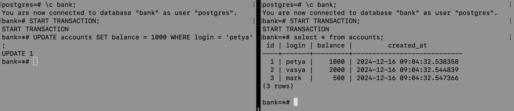
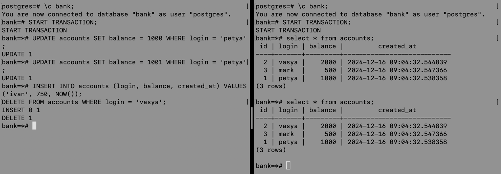
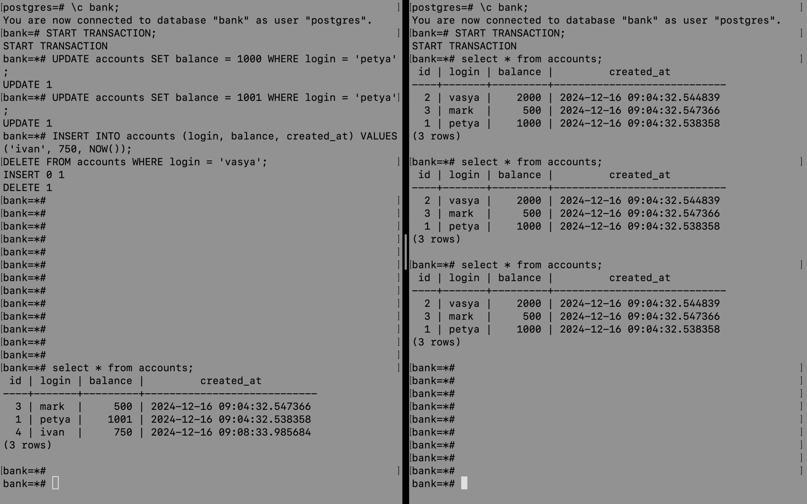

# Уровни изоляции
(На примере postgres)

Повторяю сценарий из статьи, вместо MySQL использую PostgreSQL: https://habr.com/ru/articles/469415/

Сначала мы создаём в докере БД bank и наполняем её данными в соответствии со скриптом:

```roomsql
CREATE DATABASE bank;

\c bank;

create table accounts
(
	id SERIAL
		primary key,
	login varchar(255) not null,
	balance bigint default 0 not null,
	created_at timestamp default now()
);

insert into accounts (login, balance) values ('petya', 1000);
insert into accounts (login, balance) values ('vasya', 2000);
insert into accounts (login, balance) values ('mark', 500);
```

## 1. Read uncommitted

В PostgreSQL вместо Read uncommitted используется Read committed.
Выполняя шаги из статьи можем убедиться, что транзакции не видят не закоммиченные изменения.

Шаги:
- открыть два терминала, начать транзакцию в каждом.
- просмотреть текущее содержание таблиц, убедиться что оно идентично.
- в первом (левом) терминале выполнить команды INSERT, DELETE, UPDATE
- во втором (правом) терминале выполнить SELECT * FROM accounts (просмотреть содержимое таблицы)
- видим, что вторая транзпкция не видит изменения
- во втором терминале делаем запрос SELECT SUM(balance) FROM accounts: полученные данные не учитывают незакоммиченные изменения
- в первом терминале выполняем ROLLBACK;
- во втором терминале повторно делаем запрос SELECT SUM(balance) FROM accounts
- видим, что значение то же (вторая транзакция и раньше не видела этих изменений)


## 2. Read committed

Для этого уровня параллельно исполняющиеся транзакции видят только зафиксированные изменения из других транзакций.
Повторяя шаги из статьи, можно убедиться, что ситуация не повторяется.

Шаги:
- открыть два терминала, начать транзакцию в каждом.
- просмотреть текущее содержание таблиц, убедиться что оно идентично.
- в первом (левом) терминале выполнить команды INSERT, DELETE, UPDATE
- в первом (левом) терминале выполнить SELECT * FROM accounts (просмотреть содержимое таблицы)
- во втором (правом) терминале выполнить SELECT * FROM accounts (просмотреть содержимое таблицы)
- видим, что в первом терминале - информация с учётом не закомиченных изменений, во втором - без их учёта
- в первом терминале выполняем COMMIT;
- во втором терминале повторно делаем запрос SELECT * FROM accounts
- видим, что значения обновились


## 3. Repeatable read

Мы не видим в исполняющейся транзакции измененные и удаленные записи другой транзакцией. Но все еще видим вставленные записи из другой транзакции.

Шаги:
- открыть два терминала, начать транзакцию в каждом.
- просмотреть текущее содержание таблиц, убедиться что оно идентично.
- в первом (левом) терминале выполнить команды INSERT, DELETE, UPDATE
- во втором (правом) терминале выполнить UPDATE той же строки, что и на предыдущем шаге: комманда не выполняется, ждёт когда в первом терминале зафиксируют изменения или откатят их
  
- в первом терминале выполняем COMMIT: после этого во втором терминале команда тоже выполнелась и завершилась
  
- во втором терминале делаем запрос SELECT * FROM accounts
- видим, что значения обновились корректно


## 4. Serializable

Транзакции ведут себя как будто ничего более не существует, никакого влияния друг на друга нет.

Шаги:
- открыть два терминала, начать транзакцию в каждом.
- во втором (правом) терминале делаем запрос SELECT * FROM accounts
- в первом (левом) терминале выполнить команду UPDATE
- по статье должны получить lock, но на самом деле запрос выполняется и завершается успешно (сделала два UPDATE, оба прошли)
  
- аналогично выполняем запросы INSERT, DELETE: результат тот же
- во втором (правом) терминале повторно делаю запрос SELECT * FROM accounts: данные не изменились
  
- в первом (левом) терминале делаю запрос SELECT * FROM accounts: данные отображаются с учётом внесённых изменений в рамках этой транзакции
  

То есть вторая транзакция если прочитала какие-то данные, то уже не видит дальнейших изменений, которая производит первая транзакция. При этом первая транзакция их видит и может использовать.