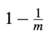

# Задача

- Создать таблицу, проиндексировать её различными индексами и сравнить хранимый объём (только индекс). Рассмотреть индекс по одной колонке, по двум и по выражению. Среди индексов использовать как минимум 4: хэш-индекс, B-дерево, Bloom filter и еще один по вашему выбору из доступных в PostgreSQL (включая расширения).

- Пусть для Bloom-фильтра используется хэш шириной 32 бита (т.е. для хранения требуется 2^30 / 8 / 1024^2 = 512 Мбайт). Посчитать вероятность, что при вставке 2 млн записей с различными (уникальными) ключами возникнет хотя бы одна коллизия. Множество ключей конечно. Набор записываемых ключей (2 млн записей) выбирается равномерно из всех подмножеств (соответствующего размера) множества ключей. Возвращаемые значения хэш-функции распределены равномерно, если ключи из множества ключей выбираются равномерно. Вывести формулу, где число записываемых ключей считать переменной, а затем подставить в неё 2 млн. Если затрудняетесь посчитать точно, то хотя бы приблизительно оцените формулой/методом на ваш выбор.

Практическая часть:

Запросы выполнялись через pgAdmin

- B-дерево: 16kb
- хэш-индекс: 32kb
- spgist: 24kb
- Bloom filter: 16kb

```roomsql
-- -- удаляю таблицы
--
-- drop table book;
-- drop table author;

 -- создаю таблицы

 CREATE TABLE author (
   id SERIAL PRIMARY KEY,
   name VARCHAR(100) NOT NULL
 );

 CREATE TABLE book (
   id SERIAL PRIMARY KEY,
   title VARCHAR(255) NOT NULL,
   author_id INT NOT NULL,
   public_year SMALLINT NULL,
   CONSTRAINT fk_author FOREIGN KEY(author_id) REFERENCES author(id));

 -- заполняю таблицы

 INSERT INTO author(name) VALUES('Virginia Woolf');
 INSERT INTO author(name) VALUES('Harper Lee');
 INSERT INTO author(name) VALUES('F. Scott Fitzgerald');
 INSERT INTO author(name) VALUES('J.R.R. Tolkien');
 INSERT INTO author(name) VALUES('George Orwell');
 INSERT INTO book(title, author_id, public_year) VALUES
 ('Mrs. Dalloway',1,1925),
 ('To the Lighthouse',1,1927),
 ('To Kill a Mockingbird',2,1960),
 ('The Great Gatsby',3,1925),
 ('The Lord of the Rings',4,1955);
 INSERT INTO book(title, author_id, public_year) VALUES
 ('1984',(SELECT id FROM author WHERE name = 'George Orwell'),1949),
 ('Animal Farm',(SELECT id FROM author WHERE name = 'George Orwell'),1945);

 -- создаю btree индексы и меряю их размер

 -- одна колонка
 CREATE INDEX i_btree ON author (name);
 -- смотрю размер
 SELECT pg_size_pretty(pg_relation_size('i_btree'));
 DROP INDEX i_btree;

 -- две колонки
 CREATE INDEX i_btree ON book (title, public_year);
 -- смотрю размер
 SELECT pg_size_pretty(pg_relation_size('i_btree'));
 DROP INDEX i_btree;

 -- выражение
 CREATE INDEX i_btree ON author ((lower(name)));
 -- смотрю размер
 SELECT pg_size_pretty(pg_relation_size('i_btree'));
 DROP INDEX i_btree;

 -- создаю hash индексы и меряю их размер

 -- одна колонка
 CREATE INDEX i_hash ON author USING hash (name);
 -- смотрю размер
 SELECT pg_size_pretty(pg_relation_size('i_hash'));
 DROP INDEX i_hash;

-- -- две колонки - говорит для этого индекса это не возможно
-- CREATE INDEX i_hash ON book USING hash (title, public_year);
-- -- смотрю размер
-- SELECT pg_size_pretty(pg_relation_size('i_hash'));
-- DROP INDEX i_hash;

 -- выражение
 CREATE INDEX i_hash ON book USING hash (lower(title));
 -- смотрю размер
 SELECT pg_size_pretty(pg_relation_size('i_hash'));
 DROP INDEX i_hash;

 -- создаю spgist индексы и меряю их размер

 -- одна колонка
 CREATE INDEX i_spgist ON author USING spgist (name);
 -- смотрю размер
 SELECT pg_size_pretty(pg_relation_size('i_spgist'));
 DROP INDEX i_spgist;

-- -- две колонки - говорит для этого индекса это не возможно
-- CREATE INDEX i_spgist ON book USING spgist (title, public_year);
-- -- смотрю размер
-- SELECT pg_size_pretty(pg_relation_size('i_spgist'));
-- DROP INDEX i_spgist;

 -- выражение
 CREATE INDEX i_spgist ON book USING spgist (lower(title));
 -- смотрю размер
 SELECT pg_size_pretty(pg_relation_size('i_spgist'));
 DROP INDEX i_spgist;

 -- создаю bloom индексы и меряю их размер

 create extension bloom;

 -- одна колонка
 CREATE INDEX i_bloom ON author USING bloom (name);
 -- смотрю размер
 SELECT pg_size_pretty(pg_relation_size('i_bloom'));
 DROP INDEX i_bloom;

 -- две колонки
 CREATE INDEX i_bloom ON book USING bloom (title, author_id);
 -- смотрю размер
 SELECT pg_size_pretty(pg_relation_size('i_bloom'));
 DROP INDEX i_bloom;

 -- выражение
 CREATE INDEX i_bloom ON book USING bloom (lower(title));
 -- смотрю размер
 SELECT pg_size_pretty(pg_relation_size('i_bloom'));
 DROP INDEX i_bloom;

```

Теоретическая часть:
Используется Bloom-фильтр: массив из m бит, k различных хеш-функций h_1 ... h_k, вставка n записей с различными (уникальными) ключами.
(m = 2^32 (?), k = 32, n = 2млн, (для хранения требуется 2^30 / 8 / 1024^2 = 512 Мбайт))
(Картинки вставлены из моего overleaf, не нашла, как отобразить в md формулы - локально отображается, удалённо нет)

1. При вставке: вероятность, что в j-ый бит не будет записана единица i-ой хеш-функцией  
   <!--
   
   -->  
   
   
2. При вставке: вероятность, что в j-ый бит будет записан 0 (то есть ни одна хеш-функция не записала 1)  
   <!--
   
   -->  
   
   
3. При вставке n элементов: вероятность, что в j-ый бит будет записан 0  
   <!--
   
   -->  
   
   
4. При вставке n элементов: вероятность, что в j-ый бит будет записано 1  
   <!--
   
   -->  
   
   
5. При вставке n элементов: вероятность, что ни в один бит не будет записан 0 (во все биты будут записаны 1)  
   <!--
   
   -->  
   
   

Итог:
<!--

-->  


(примерно)